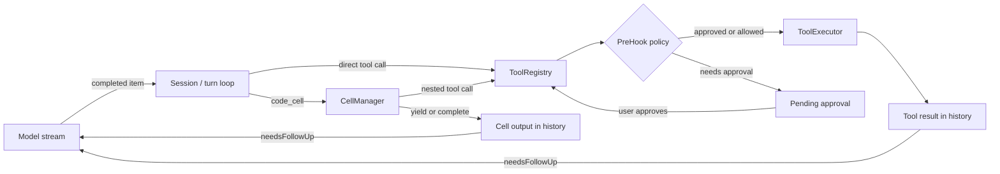

# Go Agent Harness — rebuild Codex's runtime skeleton in Go

This repository is a small, safe teaching harness for learning the design of
the open-source [Codex](https://github.com/openai/codex) runtime. It is **not**
a Codex fork and it never runs arbitrary shell commands: the demo registers
only a deterministic `echo` executor.

The goal is to understand the control-flow boundaries that make an agent
harness work: model turns, streamed output items, tool execution, approvals,
retries, cancellation, and code-mode cells.

```sh
go test ./...
go run .
```

## The runtime in one picture



The outer `Session` owns the turn. The `ToolRegistry` owns the policy →
executor boundary. A cell is a persistent program execution unit, **not** a
second agent. Its nested calls reuse the exact same registry and approval
policy as direct calls.

## What is implemented

| Area | Teaching implementation |
| --- | --- |
| Turn loop | Streaming model events; only completed items become durable history; follow-up re-enters the outer loop. |
| Tool dispatch | `PreHook → executor → PostHook`, structured results, bounded retry, per-tool timeout. |
| Parallelism | Tool futures may execute concurrently; history drains in original model-item order. |
| Approval | Approval is a terminal dispatch outcome; direct calls and nested cells resume their exact continuation without replaying model output. |
| Cancellation | A cancelled turn drains started work, never samples again, and terminates its active cells. |
| Observability | `TurnObserver` projects runtime events without polluting model history. |
| Code mode | In-process persistent cells with yield/wait/completion; provenance for direct versus nested calls. |
| Host boundary | A host-facing adapter separates host `invocation_id` from runtime IDs, completes the original callback after approval, and rejects cancelled nested calls. |

## Code mode: two layers, one ownership rule

The in-process cell implementation exposes the runtime semantics first. The
host adapter then exposes the protocol seam used by real Codex:

```mermaid
sequenceDiagram
    participant H as Code-mode host
    participant A as HostNestedToolAdapter
    participant R as ToolRegistry
    participant E as Executor

    H->>A: ToolCall(invocation_id, cell_id, runtime_tool_call_id)
    A->>R: Start(internal ToolCall + provenance)
    alt policy allows
        R->>E: Handle
        E-->>R: ToolResult
        R-->>A: result
        A->>H: CompleteToolCall(same invocation_id, result)
    else policy needs approval
        R-->>A: ApprovalRequest
        Note over A: retain original call by invocation_id
        A->>R: StartAfterApproval(original call)
        R->>E: Handle once
        A->>H: CompleteToolCall(same invocation_id, result)
    else host cancels
        H->>A: ToolCallCancelled(invocation_id)
        Note over A: remove pending call; never run executor
    end
```

This explains the key distinction: code mode is an **execution modality** that
can invoke tools; it neither replaces tool executors nor creates a multi-agent
system.

## Where to read

For the shortest useful path, read these in order:

1. [01-runtime-skeleton.md](docs/01-runtime-skeleton.md) and [session.go](session.go): the outer turn loop and `needsFollowUp`.
2. [registry.go](registry.go): `PreHook → executor → PostHook` and approval as a terminal outcome.
3. [executor.go](executor.go): reusable executor contract versus harness orchestration.
4. [stream.go](stream.go), [model.go](model.go), and [19-ordered-future-draining.md](docs/19-ordered-future-draining.md): streamed items and deterministic future draining.
5. [cell.go](cell.go), then [25-code-cell-in-the-turn-loop.md](docs/25-code-cell-in-the-turn-loop.md): code cells re-entering the same turn loop.
6. [28-codex-code-mode-host-boundary.md](docs/28-codex-code-mode-host-boundary.md) through [31-host-nested-cancellation.md](docs/31-host-nested-cancellation.md): the real host protocol boundary.

The local, read-only upstream clone is at `reference/codex` (ignored by Git).
The most relevant upstream contract is
`codex-rs/code-mode-protocol/src/grpc/codex.code_mode.v1.proto`.

## Deliberate limits

This is a learning model, not a production agent platform. It does not yet
include a JavaScript runtime, generated gRPC client, reconnect/completion retry,
or cancellation of an executor that is already running on behalf of a remote
host. Those are good future exercises precisely because the boundaries above
now make them isolated additions rather than turn-loop rewrites.

For the detailed, checkbox-level learning record, see
[docs/TRACKING.md](docs/TRACKING.md). Each behavior change has a corresponding
test in [main_test.go](main_test.go).
